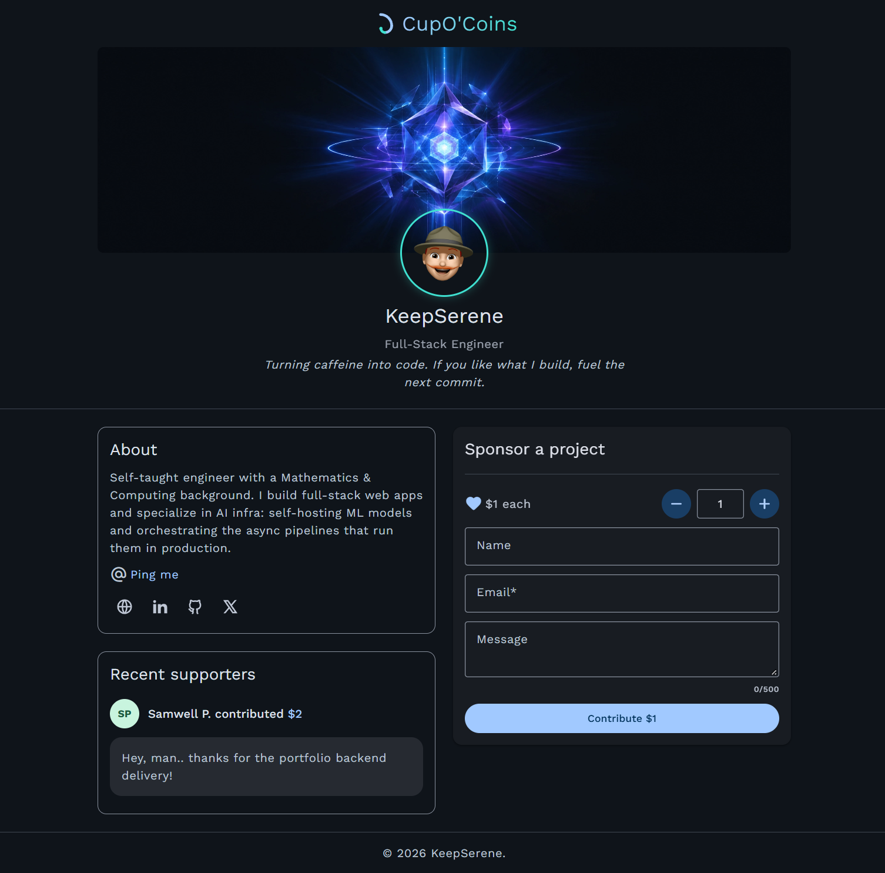

<div align="center">

  

# CupO'Coins ☕

A minimalist "buy me a coffee" support page — pay-what-you-want contributions, a public supporters wall, and a Polar-powered checkout, built from scratch with Express and vanilla front-end code.


</div>

---

## 📸 Screenshot



## 🔗 Live Demo

**[cup-of-coins.onrender.com](https://cup-of-coins.onrender.com)** _(update once deployed)_

> ⚠️ This is hosted on Render's free tier, which spins the service down after periods of inactivity. **The first request after a period of inactivity can take ~50 seconds** to wake it back up — subsequent requests are fast. This is a hosting-tier limitation, not an app performance issue.
>
> This demo runs against **Polar's sandbox environment** — no real payments are processed. See [Payments & Polar Sandbox](#-payments--polar-sandbox) below.

---

## 📖 Table of Contents

- [Overview](#-overview)
- [Features](#-features)
- [Tech Stack](#-tech-stack)
- [Project Structure](#-project-structure-tentative)
- [Payments & Polar Sandbox](#-payments--polar-sandbox)
- [Why a Custom Webhook Verifier?](#-why-a-custom-webhook-verifier)
- [Local Development Tunnel](#-local-development-tunnel)
- [Getting Started](#-getting-started)
- [Environment Variables](#-environment-variables)
- [Known Limitations](#-known-limitations)
- [Author](#-author)
- [License](#-license)

---

## 🧭 Overview

CupO'Coins is a single-page "support my work" site in the spirit of Buy Me a Coffee / Ko-fi — a place where visitors can leave a small pay-what-you-want contribution, sign it with their name (or X handle) and a short message, and see themselves show up on a public supporters wall. It's built as a small, complete, production-style full-stack project rather than a wrapper around a third-party button: the checkout flow, webhook verification, avatar generation, and form validation are all hand-rolled.

The whole app is one Express server rendering a single EJS page, backed by MongoDB for supporter records and Polar for payment processing.

## ✨ Features

**Contributions & payments**

- Pay-what-you-want checkout for any **whole-dollar amount between $1 and $999**, handed off to Polar's hosted checkout page.
- Amounts are deliberately whole dollars only — a tipping gesture doesn't need decimal precision, and it sidesteps an entire class of floating-point rounding bugs (`amountInCents` is stored as an integer throughout).
- The $1–$999 range is enforced everywhere _this app_ controls the amount (the input widget, and the `/checkout` endpoint), but Polar's "pay what you want" pricing has no built-in maximum — a supporter can raise the amount on Polar's own page. When that happens the server logs it for visibility rather than silently rejecting real money.
- Supporter name/message metadata is round-tripped through Polar's checkout `metadata` field and read back on the `order.paid` webhook, so no app-specific data needs to live on Polar's side.

**Supporters wall**

- The 5 most recent supporters are rendered on load, each with an auto-generated avatar.
- **Avatars are generated, not uploaded:** initials are extracted from the supporter's name (handling accents, apostrophes, and `@XHandles` gracefully — e.g. `O'Connor` → `OC`, `@jane_doe` → `JD`), and a background color is picked deterministically by hashing the name into one of 5 preset palette slots — so the same name always renders with the same color, with zero images stored or served.
- Supporter records are de-duplicated at the database level: each one is tied to the Polar checkout ID that produced it (`unique` index), so a retried webhook delivery can never double-insert the same contribution.

**Form UX**

- The dollar-amount stepper blocks non-digit keystrokes _before_ they're inserted (via `beforeinput`), rather than sanitizing after the fact — the naive "strip bad characters on `input`" approach re-assigns the field's value mid-type and silently scrambles the cursor position.
- A live character counter on the message field shifts color as it approaches the 500-character limit.
- Name/X-handle format, email format, message length, and amount bounds are all validated **client-side for instant feedback and independently server-side** — the server never trusts the client.
- The success banner auto-dismisses and cleans the `?success=true` query param from the URL, so a page refresh doesn't re-show it.

**Security & reliability**

- [Helmet](https://helmetjs.github.io/) sets standard secure HTTP headers on every response.
- The webhook route is mounted _before_ the global body parser and uses `express.raw()` scoped to just that route — Polar signs the exact raw request bytes, so letting any JSON/urlencoded parser touch the body first would break signature verification.
- All required environment variables are validated at startup (`requireEnv`) — the app fails fast and loudly instead of limping along with `undefined` config.

## 🛠 Tech Stack

| Layer            | Technology                                                          |
| ---------------- | ------------------------------------------------------------------- |
| Runtime          | Node.js                                                             |
| Server framework | Express 5                                                           |
| Templating       | EJS                                                                 |
| Database         | MongoDB via Mongoose                                                |
| Payments         | Polar (sandbox) — hosted checkout + webhooks                        |
| Security headers | Helmet                                                              |
| Front end        | Vanilla JavaScript, HTML, CSS (custom design system — no framework) |
| Package manager  | pnpm                                                                |
| Local tunneling  | ngrok                                                               |
| Deployment       | Render                                                              |

## 📂 Project Structure (Tentative!)

```
cup-of-coins/
├── app.js                       # Express app setup & startup
├── public/
│   ├── css/                     # styles.css, components.css, utils.css
│   ├── js/script.js             # Counter, form validation & submission, banner logic
│   └── images/                  # logo, favicon, hero art, screenshot
├── src/
│   ├── config/
│   │   ├── db.config.js         # Mongoose connection
│   │   ├── polar.config.js      # Polar SDK client + pinned API version
│   │   └── contribution.config.js  # Shared MIN/MAX contribution bounds
│   ├── controllers/
│   │   ├── home.controller.js
│   │   ├── checkout.controller.js
│   │   └── webhook.controller.js
│   ├── models/
│   │   └── supporter.model.js
│   ├── routes/
│   │   ├── home.route.js
│   │   ├── checkout.route.js
│   │   └── webhook.route.js
│   ├── utils/
│   │   ├── avatar.util.js       # Initials + deterministic avatar color
│   │   └── webhook.util.js      # Hand-rolled Standard Webhooks verification
│   └── views/
│       ├── layouts/head.ejs
│       └── pages/home.ejs
└── .env.sample
```

## 💳 Payments & Polar Sandbox

Payments are handled entirely by [Polar](https://polar.sh), running against their **sandbox environment** (no real money moves in this deployment). The flow:

1. The visitor fills out the contribution form on the home page; the client validates it, then `POST`s to `/checkout`.
2. `checkout.controller.js` re-validates everything server-side, then calls `polarClient.checkouts.create(...)` to open a Polar-hosted checkout session with the amount, email, name, and message (as metadata) attached.
3. The visitor completes payment on Polar's hosted page and is redirected back to the site.
4. Independently, Polar delivers an `order.paid` **webhook** to `/webhooks/polar` once the payment settles. The webhook handler verifies the signature, then persists a `Supporter` document (name, message, amount, and the originating checkout ID for idempotency) to MongoDB.

Recording supporters via the webhook — rather than on the checkout redirect — means the supporters wall only ever reflects payments Polar has actually confirmed, not ones a visitor merely started.

## 🔐 Why a Custom Webhook Verifier?

`src/utils/webhook.util.js` implements [Standard Webhooks](https://www.standardwebhooks.com/) HMAC-SHA256 signature verification by hand, instead of using `validateEvent` from `@polar-sh/sdk/webhooks`.

This wasn't a stylistic choice — `validateEvent` in `@polar-sh/sdk@0.49.0` was rejecting **genuinely valid** Polar sandbox webhook deliveries with a `"No matching signature found"` error. This was confirmed to be an SDK-side bug, not a configuration issue, by manually recomputing the Standard Webhooks HMAC (stripping the `whsec_` prefix, base64-decoding the remainder as the key, and hashing `{id}.{timestamp}.{raw body}`) and getting a **byte-for-byte match** against Polar's `webhook-signature` header — using the exact same secret, headers, and raw body that `validateEvent` was simultaneously rejecting.

The hand-rolled `verifyPolarWebhook()` does the same spec-compliant computation, with a constant-time comparison (`crypto.timingSafeEqual`) and support for multiple space-separated signatures in the header (relevant during secret rotation). If a future SDK release fixes the underlying bug, this can likely be swapped back for the official helper.

## 🌐 Local Development Tunnel

Polar's webhook delivery needs a **publicly reachable HTTPS URL** to send `order.paid` events to — it has no way to reach a server running on `localhost`. During local development, the `pnpm tunnel` script (`ngrok http 3000`) exposes the local server to the internet so Polar's sandbox can actually deliver webhooks to `/webhooks/polar`.

The ngrok URL changes every time the tunnel restarts, so it needs to be kept in sync with:

- `POLAR_SUCCESS_URL` / `POLAR_RETURN_URL` in `.env`
- the webhook endpoint URL registered in the Polar sandbox dashboard

In production (Render), this isn't needed at all — the deployed service already has a stable public HTTPS URL.

## 🚀 Getting Started

```bash
# 1. Clone the repo
git clone https://github.com/KeepSerene/cup-of-coins.git
cd cup-of-coins

# 2. Install dependencies (this project uses pnpm)
pnpm install

# 3. Copy the env template and fill in real values
cp .env.sample .env

# 4. In one terminal, start the dev server
pnpm dev

# 5. In another terminal, start the tunnel so Polar can reach your webhook
pnpm tunnel
```

After starting the tunnel, copy the `https://*.ngrok-free.dev` URL it prints into `POLAR_SUCCESS_URL` / `POLAR_RETURN_URL` in `.env`, and register `https://*.ngrok-free.dev/webhooks/polar` as the webhook endpoint in your Polar sandbox dashboard.

## 🔑 Environment Variables

All required at startup — the app throws immediately if any are missing.

| Variable               | Description                                                                                           |
| ---------------------- | ----------------------------------------------------------------------------------------------------- |
| `PORT`                 | Port the server listens on (defaults to `3000` locally; Render sets this automatically in production) |
| `POLAR_ACCESS_TOKEN`   | Sandbox access token from the Polar dashboard                                                         |
| `POLAR_PRODUCT_ID`     | ID of the pay-what-you-want product to check out against                                              |
| `POLAR_WEBHOOK_SECRET` | Signing secret for verifying incoming webhooks                                                        |
| `POLAR_SUCCESS_URL`    | Where Polar redirects after a successful payment                                                      |
| `POLAR_RETURN_URL`     | "Back" URL shown on the Polar checkout page                                                           |
| `MONGODB_URI`          | MongoDB connection string                                                                             |

See `.env.sample` for the exact format.

## ⚠️ Known Limitations

- **This deployment runs against Polar's sandbox** — it's a fully working payment flow, but no real money changes hands. A production launch would need Polar's live environment and a live access token.
- Polar's "pay what you want" pricing supports a minimum and a default pre-filled amount, but **no configurable maximum** — a supporter can exceed the site's advertised $999 max on Polar's own checkout page. This is logged server-side but intentionally not blocked, since it's real money already paid.

## 👤 Author

**Dhrubajyoti Bhattacharjee** (KeepSerene) — Full-Stack Engineer

- Portfolio: [math-to-dev.vercel.app](https://math-to-dev.vercel.app/)
- LinkedIn: [dhrubajyoti-bhattacharjee](https://www.linkedin.com/in/dhrubajyoti-bhattacharjee-320822318/)
- GitHub: [@KeepSerene](https://github.com/KeepSerene)
- X: [@UsualLearner](https://x.com/UsualLearner)

## 📄 License

Licensed under the [Apache License 2.0](./LICENSE).
